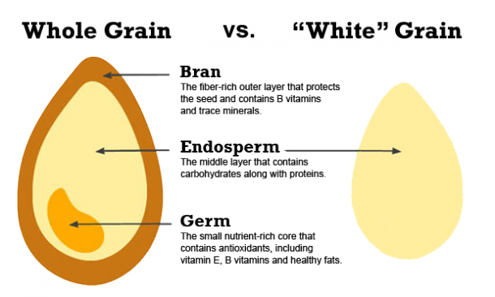

# Diet

* Get rid of processed junk food, sugar and processed carbs
* Eat more vegetables, nuts, and fruits, organic lean protein and healthy fats, such as olive oil, fish oils, and avocados
* Try eating several small meals each day and avoid late night snacking.
* Eat some protein for breakfast, lots of vegetables, fruits, and fiber and drink water rather than calorie-laden beverages.
* Don't cut calories drastically or you could inadvertently lower your metabolism.
* Bottom line: eat more high quality, nutrient-rich foods and eat fewer empty, processed calories.

## Processed Carbs

* Refined grains are the grains that have had the fibrous and nutritious parts removed. The biggest source is white flour made from refined wheat.
* When grains are refined, almost all the fiber, vitamins and minerals are removed from them. Some producers enrich their products with synthetic vitamins after processing.
* Refined carbs cause rapid spikes in blood sugar and insulin levels, and only make you feel full for a short time. This is followed by a drop in blood sugar, hunger and cravings.
* Because they are low in fiber and digested quickly, eating refined carbs can cause major swings in blood sugar levels. This can contribute to overeating

