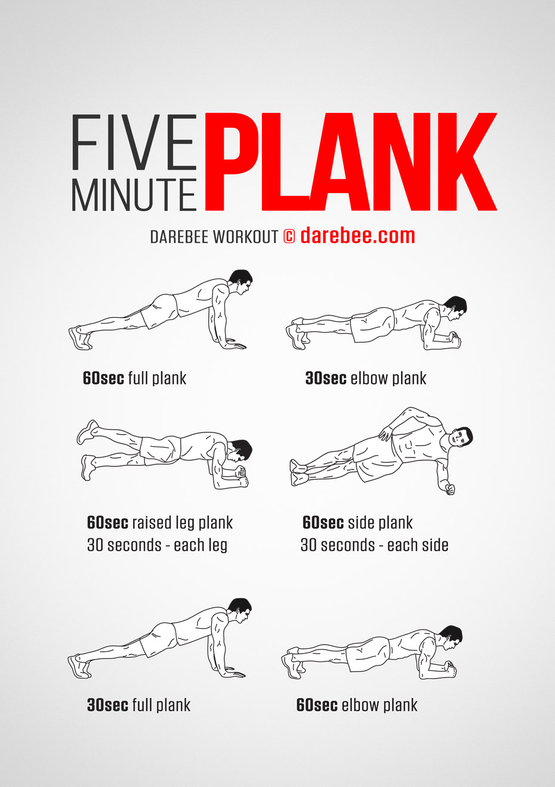

# 5 Minutes Planking

I follow this simple planking workout to exercise;

| # | Time| Position |
| - | ---- | -------- |
| 1 | 60 secs | Full Plank |
| 2 | 30 secs | Elbow Plank |
| 3 | 30+30 secs | Raised Leg Plank (each side) |
| 4 | 30+30 secs | Side plank (each side) |
| 5 | 30 secs | Full plank |
| 6 | 60 secs | Elbow plank |

## Poster

